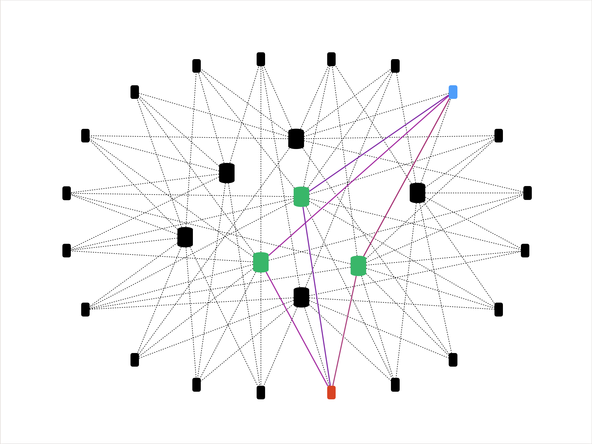
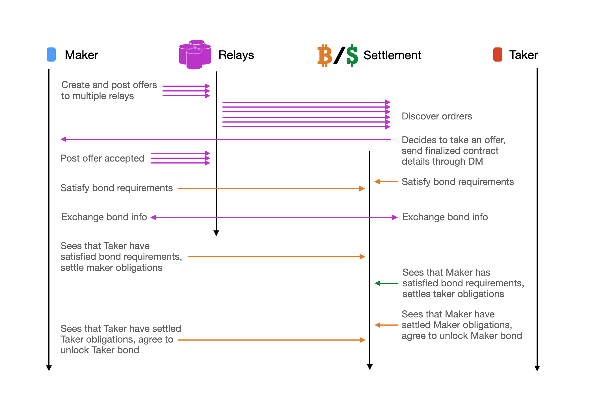

# N3XB
*Naive Nostr No-KYC Exchange for Bitcoin*

N3X (Naive Nostr No-KYC Exchange) is a protocol inspired by, and runs on top of Nostr. The goal is to be a simple but extensible protocol to facilitate exchanges and marketplaces in an interoperable, censorship-resistant, privacy-aware, and decentralized manner. The initial example of N3X might be a Bitcoin <=> fiat decentralized exchange protocol, codenamed N3XB, but any type of marketplace or exchange should potentially be enabled with N3X.

## TLDR

At the heart, N3X is a maximally simplified protocol for abstract contractual exchange involving 2 parties and 1 dispute resolution 3rd party. N3XB increases the specificity such that 1 party is exchanging Bitcoin in specifiable ways for an off-chain obligation, with the 3rd party mediation done via 2 sided Bitcoin fidelity bonds in specifiable configurations. The intention is for all information necessary for protocol operations, to live inside the `content` field of the Nostr `event` object, and Nostr clients to distinguish N3X events with a specific `kind` field value reserved with consensus from the Nostr community.

## Why?

> *Because Projects often Dies. But Protocols are more adaptable and better Survives*

- Numerous monolithic No-KYC exchanges exists. Some with more liquidity than others, but none individually manages to capture a sufficiently significant trading volume to create a network effect
- None of the UX of the No-KYC exchanges are ideal. Development and innovation whether it be in business logic or UI/UX is often slow and constantly hit significant resource constraints. 
- Onboarding of new developers are also high friction, leading to significant churn even tho the lack of willing volunteers' is not usually the crux of the problem.
- Entire projects also comes and goes. Some more prone to collapse than others. Many fails with no continuity, abandoning large swaths of users and liquidity
- Starting from a protocol, the progress of Nostr development is undeniable. Multiple independent, but inter-compatible projects with different ideas, technology and skillsets springs up overnight, and comes to fruition in months, not years. Even the best of monolithic open sourced projects are usually constraint to a particular tech stacks, where contributors rarely feel a sense of ownership, and only for a sense of volunteerism.
- Until Nostr, most decentralized open-source projects so far have treated mobile as a 2nd class citizen, if not an afterthought. Meanwhile most modern VC funded products that gained massive adoption mostly started with a mobile first mindset. Some of the most popular tech companies and applications do not have anything but mobile - Instagram, Snapchat, Tinder, etc. A key reason why decentralized open sourced project continually lose to VC funded centralized projects.
- There is also a desire for a Bitcoin fidelity bond type dispute resolution system for more arbitrary contract and exchange use-cases beyond just being a Bitcoin <=> fiat ramp.

We need to come up with a solution that is protocol first, allowing projects to be built on top, but have their liquidity and users inter-operable from each other. The protocol shall also treat mobile as a first class citizen. Otherwise even if perfect decentralization and privacy is achieved, its a futile exercise if there's nearly no users using it. A practical solutions need to have pragmatic trade-offs so that functional decentralization and privacy can be achieved and at scale. We need to enable different developers and entrepreneurs to experiment, albeit with care, on what balance between privacy, censorship resistance decentralization, and scale can be achieved for the market and marketplace they decide to tackle.

## Architecture

### Nostr Dependency

The proposed architecture assumes dependency on the existing Nostr protocol and network, with N3X offers being a `kind` of `content` inside a [Nostr `event`](https://github.com/nostr-protocol/nips/blob/master/01.md), and subsequent communications between the 2 clients being [encrypted direct messages](https://github.com/nostr-protocol/nips/blob/master/02.md). Everything regarding Nostr applies and supersedes any potential conflict you might see here. Anything specified here that contradicts the Nostr protocol would require either an amendment to this proposal, or a NIP to be done to Nostr to make possible.

### Nostr Network & Operation Sequence

With Nostr architecture, its assumed that each client is connected to multiple relays. Clients can post their offers to these relays to be discovered by other clients that might be potential takers. Perfect discovery is not possible, but it is assumed that once liquidity is sufficiently high, all trades at the margin should be similar even if perfect order discovery is not achieved. There might also be arbitrators emerging to bridge any gaps if there are large differences in the price at the margin for different order books between relays.

> Two Nostr clients and their common relays allows order publishing, order discovery and trade messaging to occur in a trust minimized and censorship resistant manner

Once a client have decided to take one of the many offers published to one or more of the relays its seeing, it can engage with the maker to complete the trade. Nostr encrypted direct messages can be used to facilitate the trade. The maker and taker can exchange their relay list also to improve reliability of communication between the two to ensure the trade can be completed even if some of the relays between the two goes away. This can include the negotiation on the usage of various fidelity bond schemes, along with agreeing on the usage of a 3rd party mediator/arbitrator. That said, Nostr and D3X is meant to only facilitate the communication required for discovery, matching and trade, but is not responsible for the value transfer itself. The value transfer for the trade can occur on the Bitcoin blockchain, on digital fiat rails, or even in other perhaps physical manners like cash or commodity asset manner. Theoretically, any trade settlement mechanisms are possible as long as all parties involved in the trade comes to an agreement.

> A simplified example on how two Nostr clients through common relays can publish, discover, and acknowledge trades, while settling value outside of the network trustlessly by utilizing fidelity bonds, most commonly implemented using Bitcoin scripts.

An important note is that, the protocol nor the relays are meant to be providing any security nor protection for the respective counter-parties. The protocol and relays are there to merely facilitate communications, discovery and messaging between trade and contract participants. Relays also act as a federated, redundant and inter-operable order book, but nothing more. Ultimately security and protection is implemented through the client software that enforces the trades by utilizing Bitcoin fidelity bonds, or by checking for on-chain confirmations or equivalent Lightning guarantees, or by the user in confirming digital fiat banking settlement, or even face to face receipt of goods, etc.

Specific proposal for exchange implementation possibilities can be found in the [XIPS](xips/) folder, starting with [XIP-00](xips/00/00.md) and [XIP-01](xips/01/01.md)