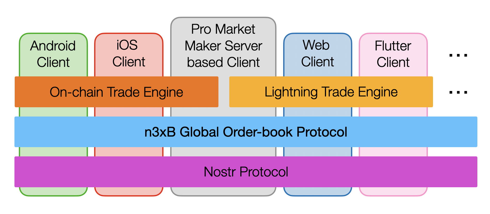

# n3xB

_naive nostr nym Exchange for Bitcoin_

n3xB (pronounced _nexbie_) is a layer 2 open protocol inspired by, and runs on top of Nostr. n3xB aspires to become a standard language for making P2P trade orders, how to negotiate between maker and takers, and on how to take these orders. Allowing different Bitcoin P2P solutions to interoperate, enabling separation of concerns, resulting in a global order book of shared deep liquidity that is not wall-gardened by any one particular solution.

## Goals

- Become the defacto global order book for P2P Bitcoin <=> Fiat trading
- Be an open protocol owned by no one, but enabling hundreds of projects to inter-operate on a common language and liquidity pool
- No specialty Nostr relays - should work with existing standard social media relays, and aspires to minimize new NIPs required
- Preserve the openness, transparency, separation of concerns, decentralization and censorship resistant properties afforded by Nostr

> n3xB's position in the broader P2P trade software/protocol stack

## Why?

Prevent fragmentation of liquidity

- Many ‘P2P’ solutions already exist, but each individually has poor liquidity. If we are able to aggregate them into a common liquidity pool, this will greatly improve competitiveness against centralized solutions

Reduce developer platform risk

- None of the existing P2P platforms have attracted 3rd party developers in building other projects on top of them. This contrasts with Nostr which has dozens of client and relay implementations within the span of 1 year. There is perception of platform risk and lack of ownership when building on another project with opaque protocol specification, vs on top of an open protocol.

Separation of concerns

- Developers can create projects which focus to innovate against a specific pain point (clients, relays, etc), without needing to create a completely new order-book or eco-system.

Mobile friendly architecture

- Nature of true P2P platforms usually prevents mobile clients from being a possibility, despite mobile being the most common and desired client platform. By using Nostr relays as a backbone, this much better enables development of mobile clients.

Maximize censorship resistance

- By building on top of Nostr, the decentralized and censorship resistant architecture of Nostr can be leveraged. This however can only be maximally achieved if _existing_ Nostr relays can be usable for trading purposes without trade aware logic or trade specific NIPs. Protocol shall be built so any new NIPs proposed are not trade specific, and are only nice-to-haves and not required for core operations.

## Protocol Proposal

### [**1 - Architecture**](/specs/architecture/architecture.md)

### [**2 - Make Order Note**](/specs/maker-note/maker-note.md)

### [**3 - Peer Messaging**](/specs/peer-messaging/peer-messaging.md)

### [**4 - Take Order Message**](/specs/taker-message/taker-message.md)

### [**5 - Trade Response Message**](/specs/trade-response/trade-response.md)

## Implementation & Demos

### [**Crusty-n3xB**](https://github.com/nobu-maeda/crusty-n3xb) - A Rust library implementing the n3xB protocol

### [**OceanSea**](https://n3xb.io/fatcrab.html) - Demo application trading fictional 'fiat' against Testnet Bitcoin

## Other Implementation Possibilities

### [**E1 - Onchain Multi-sig with trust limited Arbitrator**](/examples/on-chain/on-chain.md)

### [**E2 - Lightning with Coordinator as Maker Proxy**](/examples/lightning-proxy/lightning-proxy.md)

### [**E3 - Lightning with negotiated Coordinator**](/examples/lightning-negotiated/lightning-negotiated.md)
