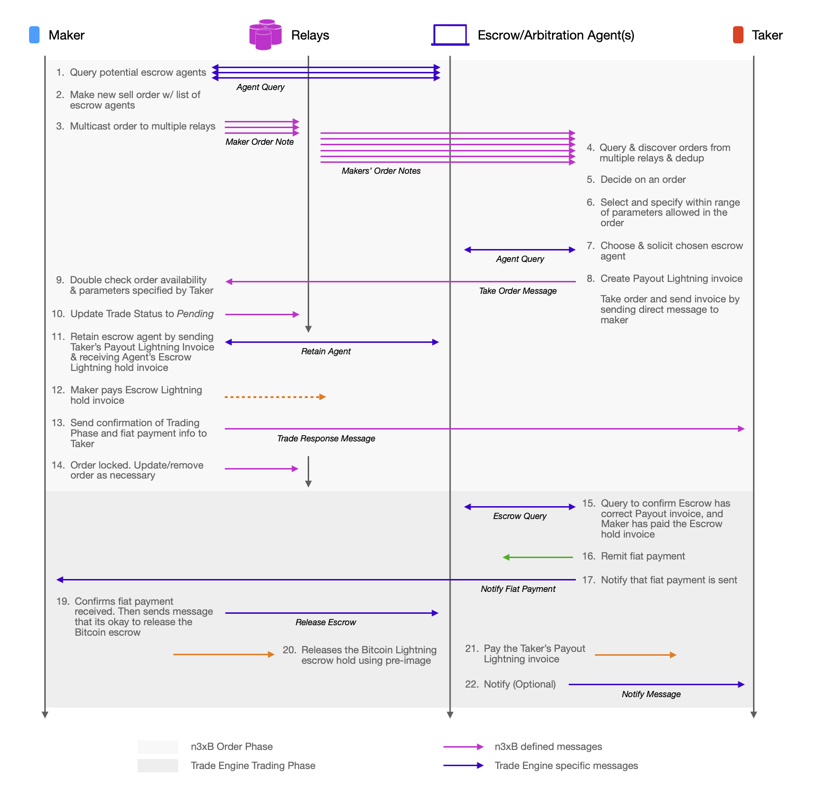

# n3xB Lightning Network Negotiated Coordinator Trade Engine Example

This trade engine mechanics is an attempt to reduce the trust required on the coordinator as otherwise seen in the [Lightning escrow proxied trade example](../lightning-proxy/lightning-proxy.md). In that example, in addition to escrow of funds, the coordinator also controls timing, relays communications, and conducts the overall trade - not to mention acting as the final arbitrator if dispute arises.

The triple roles can be reduced to just two - being just the escrow and arbitrator, by:

- Maker and Taker negotiate on which escrow/arbitrator agent to use from a list of agents, instead of it being dictated by the Maker.

- Have the trade be conducted between the Maker and the Taker, with the agent merely being a reactive escrow that responds to queries instead of being the conductor of the trade.

## Example Flow

> Maker Sells BTC w/ Lightning thru Negotiated Escrow Agent

## Agent Negotiation

The Escrow/Arbitration agent to use is negotiated in a similar fashion to how the arbitrator is selected in the [on-chain trade example](../on-chain/on-chain.md). 

The Maker starts by compiling a list of agents whom it trusts. This compilation can involve the Maker doing a query against all the potential agents by sending them a message, requesting for a response that they are ready to be retained as escrow/arbitration agents. As an example, the Maker can check when is the last time it have queried these agents. If it have queried them already in the last 24 hours, it will assume that they are still in healthy status and not query them again. This list of agents will be put into the Maker Order Note's trade engine specific payload section (step 1-3). The Maker Order Note should also have trade parameters `trusted-escrow`, and `trusted-arbitration` selected.

Once a Taker have decided to take the order, it should choose an agent which the Taker also trusts, and solicit the agent to confirm that its ready to be retained for escrow & arbitration (steps 5-7).

When the Maker have received the Take Order Message, as part of confirming trade parameters, it should also confirm the selected agent is part of the initial allowable list of agents (step 9).

## Exchange of Invoices

There are two Lightning invoices involved in the trade, similar to the [example](../lightning-proxy/lightning-proxy.md) where the trade is conducted and proxied by a coordinator.

For the final payout invoice, in this example, its generated and passed first from the Taker (buyer) to the Maker (seller) (step 8), then passed from the Maker to the agent (step 11). This creates an extra level of security of ensuring the payout will go to the correct Taker/buyer and won't be hijacked by another entity.

The escrow Lightning hold invoice is generated only after the Maker and Taker have completed negotiation for trade details, and that the Maker have retained the agent. The Agent at that point generates and sends the escrow hold invoice to the Maker (step 8), which the Maker can fulfill promptly there-after (step 9).

The Taker shall query the agent to confirm that the correct payout invoice is ready, and the Maker have funded the escrow hold invoice, before remitting fiat payment (step 15 & 16).

Once the Maker confirms with the agent that fiat payment have been received, the agent can release the escrowed Bitcoin using the pre-image on one hand (step 20), and also pay the same amount of Bitcoin to the Taker via the payout invoice (step 21), completing and settling the trade.

## Locking of Trade

Since a bond is not involved in this particular example, the Taker can back out at any time before fiat is sent. As such its chosen to have the trade status updated to `locked` after the Maker has committed funds to the escrow hold invoice, as at least the Maker cannot unilaterally back out of the trade anymore after that point.