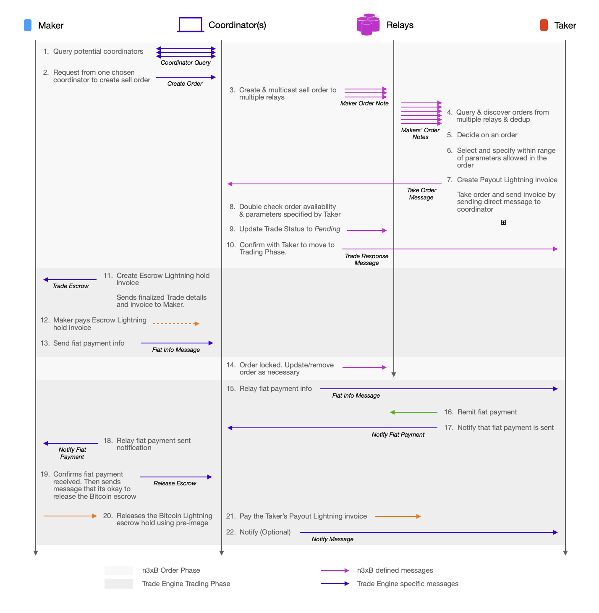

# n3xB Lightning Escrowed & Proxied Trade Example

This is an example where the Maker is proxied by a Coordinator, which also acts as an escrow, an arbitrator and an always on Lightning node. This example allows Bitcoin to be settled via the Lightning Network, in exchange for increase of trust required on the selected coordinator.

The example trade engine here is implemented on top of the *n3xB* base protocol. New trade engine specific messages are involved, along with trade engine specific payloads to go inside existing n3xB defined messages. The exact definition of the example trade engine specific messages are not defined here and left to the imagination.

## Example Flow

> Maker sells BTC thru Lightning w/ proxy & escrow by trusted coordinator

## Trusted Coordinator

There are several reasons why a trusted Coordinator is necessary for a Lightning network settlement based trade mechanics.

1. The nature of Lightning network makes it difficult for a mobile client to send Bitcoin to another mobile client, as both clients' Lightning node needs to be on at the same time for the transfer to be successful. Having a Coordinator as an always-on intermediary the coordination less difficult.

2. The lack of ability to atomically create a trustless fidelity bond, like that can be done via on-chain 2 of 2 multi-sig, also makes an intermediary escrow a necessity. Without either an atomically funded fidelity bond or an escrow, trust between the trading counterparties will be required for any trade that cannot be atomically settled simultaneously. A coordinator removes buyer/seller trust requirement.

3. Naturally then the Coordinator becomes the arbitrator if any dispute arise, as all bitcoins are escrowed by the Coordinator.

Therefore in this scheme, trust on the Coordinator is required at all times from the time the Maker selected the Coordinator as its proxy, all the way until the trade is completed.

The role of a Coordinator is actually already widely employed in Lightning settled peer to peer trading solutions like that of [RoboSats](https://learn.robosats.com/). It is also proposed and described as the *market bulletin boards* in the [CivKit whitepaper](https://github.com/civkit/paper/blob/main/civ_kit_paper.pdf). What this n3xB based example describes however is closest to what is implemented by the project [Mostro](https://mostro.network/), with the main difference being a more flexible and open standardized messaging scheme as allowed by the n3xB order book protocol.

## n3xB Defined Messaging

For this example, the Coordinator is responsible in creating the [Maker Order Note](../../specs/maker-note/maker-note.md) and multi-casting it to relays, on behalf of the Maker. The Maker Order Note should have trade parameters `trusted-escrow` and `trusted-arbitration` selected.

Once the Taker have decided to take the order, it needs to generate a Lightning invoice to later receive the final payout. The invoice can be sent as part of trade engine specific content to the Coordinator as part of the [Take Order Message](../../specs/taker-message/taker-message.md) (step 7).

## Lightning Hold Invoice as Escrow

The Coordinator generates a Lightning hold invoice as the escrow (step 11). The reason why a hold invoice is used instead of a regular Lightning invoice, is so that if the trade somehow falls through, the Bitcoin can be 'returned' back to the Maker/seller with no cost. A hold invoice allows the Coordinator to make sure funds exists from the Maker to complete the trade, but still have the option to return the funds at no cost.

The escrow is not released and 'drawn' from until fiat info is sent, relayed from the Taker to the Maker, and fiat payment is actually confirmed (steps 15 to 19). Once the Maker confirms fiat payment being received, it sends a message to the Coordinator as an okay to release the Bitcoin to the Taker (step 19). The Coordinator does so by using the pre-image and complete the Lightning payment from the escrow hold invoice (step 20), and then in turns pays the Taker's Payout Lightning invoice (step 21) as received back in step 7.

## Locking of Trade

Since a bond is not involved in this particular example, the Taker can back out at any time before fiat is sent. As such its arbitrarily chosen to have the trade status updated to `locked` after the Maker has committed funds to the escrow hold invoice, as the Maker cannot unilaterally back out of the trade anymore after that point.