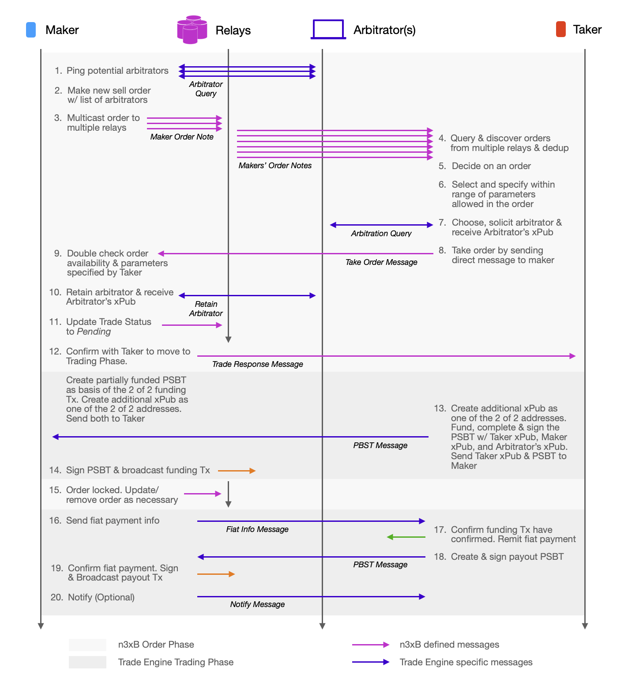
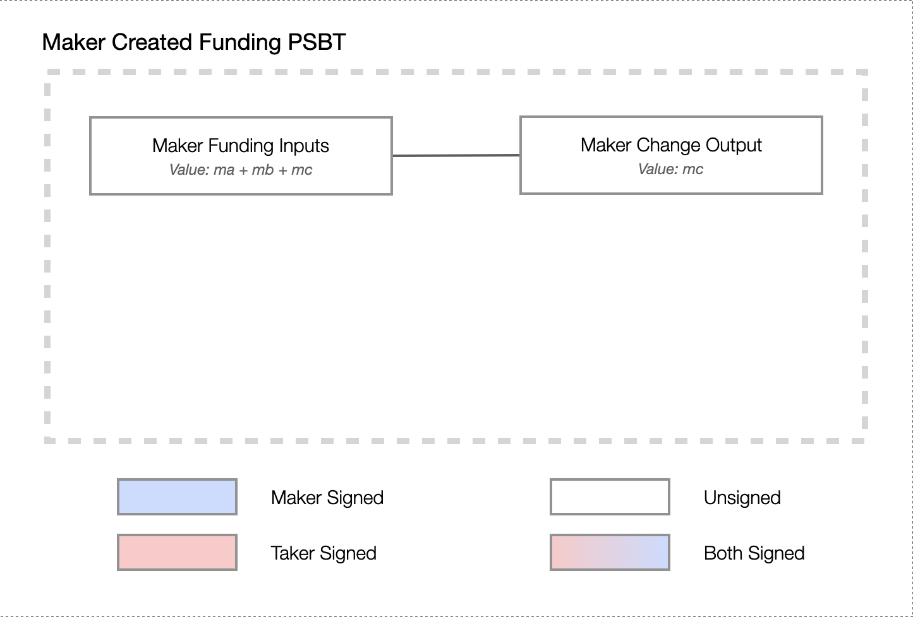
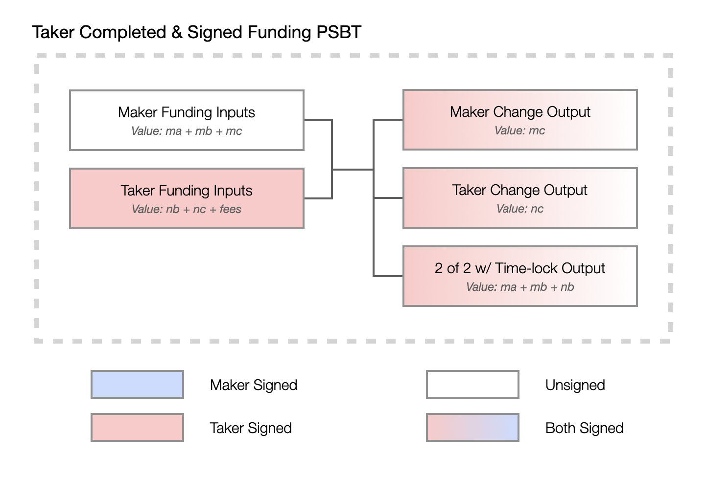
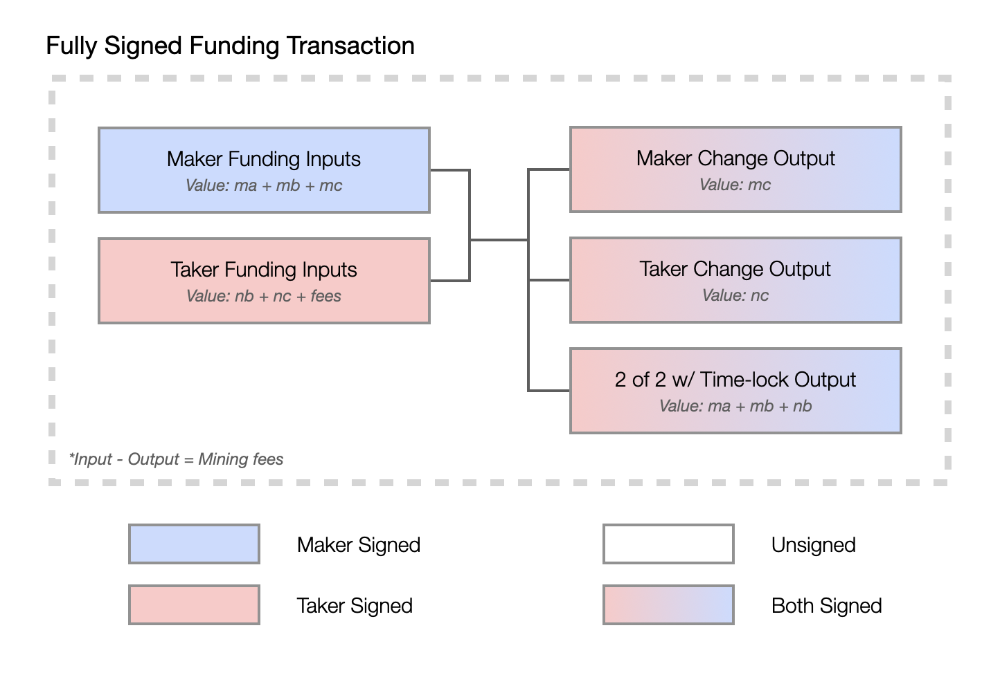
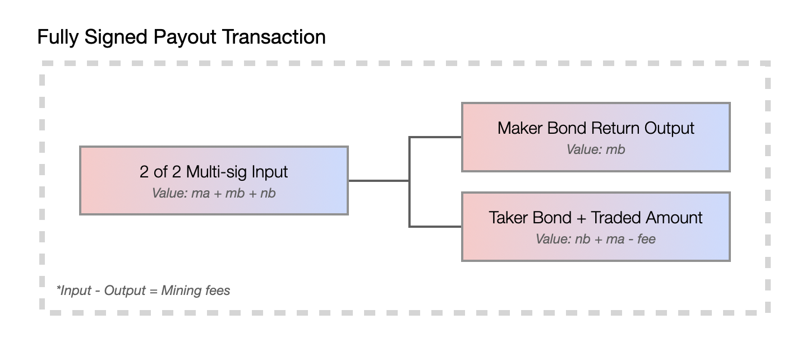

# n3xB On-Chain Multi-sig Trade Example

This is an example a Maker created an order to sell Bitcoin for fiat to a Taker. A list of 3rd party arbitrators is provided by the Maker where a Taker chooses from to act as a semi-trusted arbitrator should dispute arise. A dispute arises when a trade is not settled (funds in the 2 of 2 multi-sig is not paid out) after an agreed upon amount of time, usually 4 days. At which point the arbitrator can sweep all the funds committed, and settle the dispute based on evidence and appeals from the two trading parties.

The example trade engine here is implemented using both *n3xB*, Bitcoin on-chain 2 of 2 multi-sig as bond and settlement mechanism, and a negotiated 3rd party as arbitrator. New trade engine specific messages are involved, along with trade engine specific payloads to go inside existing n3xB defined messages. The exact definition of the example trade engine specific messages are not defined here and left to the imagination.

## Example Flow


> Example flow for Maker selling BTC with bonds, using 2 of 2 multi-signature scheme and 2 on-Chain Txs

## Arbitrator Negotiation

The Maker starts by compiling a list of arbitrators whom it trusts. This compilation can involve the Maker doing a query against all the potential arbitrators by sending them a message, requesting for a response that they are ready to be retained for arbitration. As an example, the Maker can check when is the last time it have queried these arbitrators. If it have queried them already in the last 24 hours, it will assume that they are still in healthy status and not query them again. This list of arbitrators will be put into the Maker Order Note's trade engine specific payload section. The Maker Order Note should also have trade parameters `bonds-required`, `trustless-escrow`, and `trusted-arbitration` selected.

Once a Taker have decided to take the order, it should choose an arbitrator which the Taker also trusts, and solicit the arbitrator to both confirm that its ready to be retained for arbitration, and to receive the arbitrator's xPub. This xPub will be used to receive all the funds if it ever comes down to a trade dispute.

When the Maker have received the Take Order Message, as part of confirming trade parameters, it should also confirm and retain the arbitrator for this trade as part of the routine to go into the Trade Phase.

## On-chain Multi-Sig

The mechanism to fund the traded Bitcoin amount and to lock the fidelity bonds is done atomically in a single transaction. The Maker and Taker provide both the traded amount along with the bonds into a 2 of 2 multi-sig address simultaneously through a funding transaction, with the two addresses consisting of a newly generated xPub by both the Maker and Taker respectively. A timeout clause wraps around the 2 of 2 multi-sig script such that if the amount locked in the 2 of 2 is still not paid out after a specified and mutually agreed amount of time, the arbitrator can take all the funds and allow the Maker and Taker to appeal for an arbitrated settlement.

To create the funding transaction, both the Maker and the Taker needs to:

1. Fund the transaction. In the case of Maker selling, the Maker needs to come up with the funds for the traded amount along with the bond, and the Taker buying needs to come up with just the bond amount.
2. Provide a xPub to create the 2 of 2 multi-sig which will receive all the funds.

This can be seen in the example flow in steps 12, 13 and 14. The Maker starts by creating and funding the PSBT with the traded amount and the bond amount. This involves the Maker's wallet performing an UTXO input selection, and typically results also in a change output. The output containing the 2 of 2 with timelock script cannot yet be generated at this point as the Taker's xPub is also required. Instead the Maker will create and send a new xPub, along with the partially funded PSBT to the Taker. This can be done in the Trade Response Message as a trade engine specific payload to reduce the number of messaging required.


> Example partially funded funding transaction

Once the Taker received the PSBT and xPub from the Maker, it can complete and sign the funding transaction by adding UTXO input and change output for the bond amount, along with generating the 2 of 2 with timelock output using the Maker xPub, arbitrator xPub and a new Taker xPub it generates. To make sure the correct arbitrator xPub is used, both parties should ask the agreed upon arbitrator and acquire the xPub independently and verify the output script. The acquisition of the arbitrator xPub can be seen in steps 7 and 10 in the flow diagram.


> Example completed & partially signed funding transaction

The PSBT can finally be sent back to the Maker for the final signing required before being broadcasted to the Bitcoin network. 


> Example completed & fully signed funding transaction

```
or(10@thresh(2,pk(A),pk(B)),and(pk(C),older(6)))
```
> Example script [policy](https://shiftcrypto.ch/blog/understanding-bitcoin-miniscript-part-2/) for 2 of 2 multi-sig with arbitration timelock

Once bond and funds are committed, there will be sufficient guarantee for the Maker to transmit sensitive fiat payment information, and the Taker to remit the fiat payment. Fiat payment in this example can be a Canadian Interac E-transfer, a Chinese WeChat payment, a SWIFT wire transfer, or any fiat payment that will settle before the timelock expires. This can be seen in steps 16 & 17 in the flow diagram.

Once the Maker have confirmed that fiat payment is received, it is safe for the Maker to release the Bitcoin to the Taker, along with returning the respective bond amounts in a payout transaction. The payout transaction to do so needs to be signed by both the Maker and the Taker as the funds are locked inside the 2 of 2. This can be seen in steps 18 and 19 in the flow diagram. The payout transaction can then look as follow.


> Example fully signed payout transaction

Notice that initially, the traded amount `ma` was from an input funded by the Maker. However once the trade is fully paid out, `ma` has went out to the Taker as an output. This is the net effect of this 2 of 2 multi-sig, 2 transactions on-chain trading scheme.

This on-chain multi-sig transaction flow has actually been built against Bitcoin Testnet as an example Rust based executable in the Github repo [n3xb-bdk-derisk](https://github.com/nobu-maeda/n3xb-bdk-derisk).

## Locking of trade

The trade engine here have chose to wait until all bonds have been committed before deciding that the trade is locked. This is the point where both the Maker and Taker can really no longer back out of the trade. Before this point, both the Maker and Taker can still drop the trade and have the lot of liquidity available for another counterparty and another trade. The trade status after receiving the Take Order Message and before the funding transaction is broadcasted can be considered `pending`.

## Dispute & Arbitration

If the trading counterparties failed to make sufficient forward progress and come to an agreement to complete the trade within the timelock expiry window, the trade can go into dispute. Either trading counterparties can request the arbitrator to sweep all the funds locked inside the multi-sig using the timelock clause in the multi-sig output of the funding transaction. In this case, the Maker and the Taker will need to submit evidence and appeal to the arbitrator and determine a settlement of how much the Maker and the Taker should get back respectively. This dispute process is a trusted process, as the funds once in dispute is completely under the control of the arbitrator. The only risk for the arbitrator to simply keep all the funds is bad reputation. Reputation in this case can be implemented both in band or out of band, and in this example its assumed to be established out of band. That said, this trusted dispute resolution is not engaged until the timelock expires. Otherwise a trade that never goes into dispute occurs trustlessly without any 3rd party reliance.