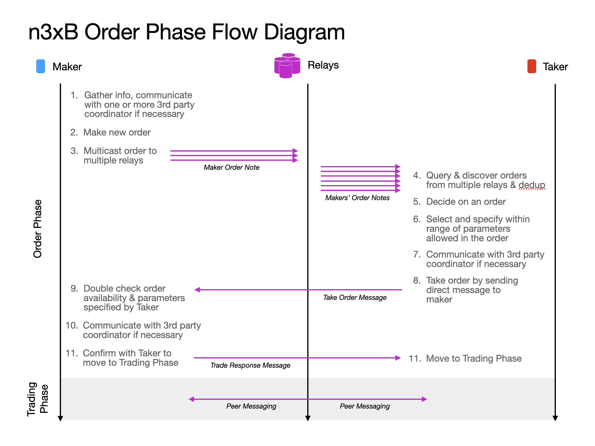
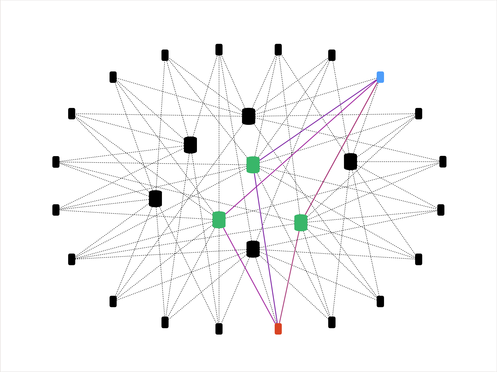

# n3xB Architecture

n3xB divides every trade transaction into two parts: One part where order is published by a maker, discovered by a taker, followed by negotiation and confirmation of matching. The other part is where order fulfillment details are exchanged, guarantees and protection are established, and the settlement of fulfillment obligations actually occurs. n3xB concerns itself mostly with the first part regarding order publishing, discovery, negotiation and matching, while supporting implementations of different trade engines to specify the second part. In the context of n3xB, we call the first part the Order phase, and the latter part the Trading phase.

A flow of a complete trade can look as below

> n3xB flow diagram emphasizing details in the order phase

## Defined Message Types

There are 1 note type and 2 message types that n3xB defines, as can be seen above. See the respective pages for further details and specifications.

### [**Maker Note**](/specs/maker-notes.md)
### [**Taker Message**](/specs/taker-message.md)
### [**Trade Messaging**](/specs/trade-messaging.md)

## Coordinator Delegation

Note that a lot of flexibility can be afforded by this architecture. As an example, an end-user peer can delegate some, or all of the participation in this flows to a coordinator, instead of treating the coordinator as an negotiable assigned 3rd party agent. The method in which a maker might want to communicate with the coordinator can be through Nostr messaging, or an out of band method, of which is not defined nor limited by the n3xB protocol. See [E2 - Lightning Implementation]() as an example.

## Nostr Multi-casting

Building atop of Nostr, each client shall be connected to multiple relays. Clients can post Maker Order Notes to these relays to be discovered by other clients that might be potential takers. A Maker Order Note will be characterized by usage of `kind` = `30078` ([NIP-78](https://github.com/nostr-protocol/nips/blob/master/78.md)), along with specific usage of generic tags ([NIP-12](https://github.com/nostr-protocol/nips/blob/master/12.md)). See the [Maker Order Note]() specification for further details.

Perfect discovery of every Maker Order Note by every potential Taker is not possible, but it is assumed that once liquidity is sufficiently high, all trades at the margin should be similar across a sample of relays given Maker multi-casting, even if perfect order discovery is not achieved. There might also be arbitrageurs emerging to bridge any gaps if there are large differences in the prices in order books between relays.

> Two Nostr clients and their common relays allows order publishing, order discovery and trade messaging to occur in a trust minimized and censorship resistant manner

## Nostr Direct Messaging

Once a client have decided to take one of offers published to one or more of the relays, it can engage with the Maker directly. Until a more privacy preserving direct messaging method is widely available, Nostr Encrypted Direct Messages [NIP-04](https://github.com/nostr-protocol/nips/blob/master/04.md) shall be used to facilitate the trade. The Maker and Taker can exchange their relay list also to improve reliability of communication between the two to ensure the trade can be completed even if some of the relays between the two goes away. Similar method can be used for communication with a 3rd party agent (optional mediator/arbitrator).

## Trade Protection & Guarantees

An important note is that, the protocol nor the relays are meant to be providing any security nor protection for the respective counter-parties. The protocol and relays are there to merely standardize and facilitate discovery and messaging between trade and contract participants. Relays also act as a federated, redundant and inter-operable order book. Ultimately security and protection shall be the responsibility of client software enforces the trades by utilizing Bitcoin fidelity bonds, or by checking for on-chain confirmations or equivalent Lightning guarantees, or by the user in confirming digital fiat banking settlement, or even face to face receipt of goods, and perhaps keeping counter-party reputation in consideration. These are all dependent on the trade engine and trade parameters agreed before a trade is established and not explicitly part of the n3xB protocol.

## Trade Engine Possibilities & Examples

Some example of trade engines possible on top of n3xB can be found below:

### [**E1 - Onchain Multi-sig with trust limited Arbitrator**]()
### [**E2 - Lightning with Coordinator as Maker Proxy**]()
### [**E3 - Lightning with negotiated Coordinator**]()
