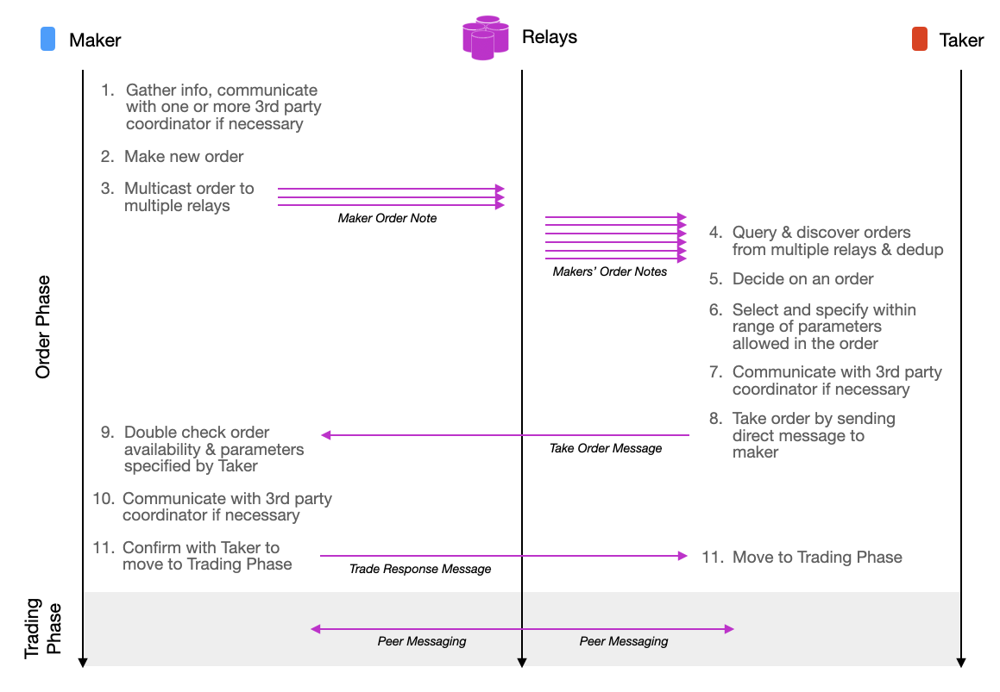

# n3xB Architecture

n3xB divides every trade transaction into two parts: One part where order is published by a maker, discovered by a taker, followed by negotiation and confirmation of matching. The other part is where order fulfillment details are exchanged, guarantees and protection are established, and the settlement of fulfillment obligations actually occurs. n3xB concerns itself mostly with the first part regarding order publishing, discovery, negotiation and matching, while supporting implementations of different trade engines to specify the second part. In the context of n3xB, we call the first part the Order phase, and the latter part the Trading phase.

A flow of a complete trade can look as below

> n3xB flow diagram emphasizing details in the order phase

## Defined Message Types

There are 1 note type, 2 message types, and 1 messaging scheme that n3xB defines, as can be seen above. See the respective pages for further details and specifications.

### [**Maker Order Note**](/specs/maker-note/maker-note.md)
### [**Peer Messaging**](/specs/peer-messaging/peer-messaging.md)
### [**Take Order Message**](/specs/taker-message/taker-message.md)
### [**Trade Response Message**](/specs/trade-response/trade-response.md)

## Coordinator Delegation

Note that a lot of flexibility can be afforded by this architecture. As an example, an end-user peer can delegate some, or all of the participation in this flows to a coordinator, instead of treating the coordinator as an negotiable assigned 3rd party agent. The method in which a maker might want to communicate with the coordinator can be through Nostr messaging, or an out of band method, of which is not defined nor limited by the n3xB protocol. See [E2 - Lightning Implementation](/examples/lightning-proxy/lightning-proxy.md) as an example.

## Nostr Multi-casting

Building atop of Nostr, each client shall be connected to multiple relays. Clients can post Maker Order Notes to these relays to be discovered by other clients that might be potential takers. A Maker Order Note will be characterized by usage of `kind` = `30078` ([NIP-78](https://github.com/nostr-protocol/nips/blob/master/78.md)), along with specific usage of generic tags ([NIP-12](https://github.com/nostr-protocol/nips/blob/master/12.md)). See the [Maker Order Note](/specs/maker-note/maker-note.md) specification for further details.

Perfect discovery of every Maker Order Note by every potential Taker is not possible, but it is assumed that once liquidity is sufficiently high, all trades at the margin should be similar across a sample of relays given Maker multi-casting, even if perfect order discovery is not achieved. There might also be arbitrageurs emerging to bridge any gaps if there are large differences in the prices in order books between relays.

> Two Nostr clients and their common relays allows order publishing, order discovery and trade messaging to occur in a trust minimized and censorship resistant manner

## Nostr Direct Messaging

Once a client have decided to take one of the orders published to one or more of the relays, it can engage with the Maker directly. Until a more privacy preserving direct messaging method is widely available, Nostr Encrypted Direct Messages [NIP-04](https://github.com/nostr-protocol/nips/blob/master/04.md) shall be used to facilitate the trade. The Maker and Taker can exchange their relay list also to improve reliability of communication between the two to ensure the trade can be completed even if some of the relays between the two goes away. Similar method can be used for communication with a 3rd party agent (optional mediator/arbitrator). See the [Peer Messaging](/specs/peer-messaging/peer-messaging.md) for further details.

## Trade Protection & Guarantees

An important note is that, the protocol nor the relays are meant to be providing any security nor protection for the respective counter-parties. The protocol and relays are there to merely standardize and facilitate discovery and messaging between trade and contract participants. Relays also act as a federated, redundant and inter-operable order book. Ultimately security and protection shall be the responsibility of client software in implementing trade engine mechanics and in enforcing the trades. Some potential mechanics trade engine and client software can utilize in protecting and guarenteeing trades includes:

- Bitcoin fidelity bonds
- Independent check of on-chain confirmations or equivalent Lightning guarantees
- Manual confirmation by user in confirming fiat banking settlement
- Manual confirmation by user in the recipient of physical or digital goods
- Avoidance of counter-party without sufficient reputation
- etc

These are all dependent on the client software implementation, trade engine mechanics, and relevant trade parameters agreed before a trade is established, and as such not explicitly part of the n3xB protocol.

## Locking of a Trade

A trade shall be considered 'locked' once both the Maker and Taker has establish certain types of guarantees that the trade will likely go through. This might be when bonds have been locked into a multi-sig and confirmed. Or when the trade amount has been escrowed by a trusted 3rd party. When a trade is considered `locked` will ultimately be trade engine specific. Regardless, when a trade is considered locked, that's when the Maker Order Notes associated with the trade needs to either be updated or be deleted. See the [Maker Order Note](/specs/maker-note/maker-note.md) specification for details.

## Trading Fees

Coordinators, Arbitrators, Reputation aggregators, etc, and specific client implementations might decide to require fees to facilitate trades, reputation attestation, or arbitrating settlements. The communication and negotiation of such is not explicitly defined by the n3xB protocol. n3xB protocol itself does not require nor defines any fees. The n3xB protocol only helps Maker and Takers convey the net amounts and exchange rates desired. Any fees will be in addition of the amounts specified and negotiated, and will have to be communicated in either a trade engine specific manner, or by the client implementations to the users directly. n3xB defined Notes and Messages however do leave room for trade engine specific communications, and as such any fees can possibly be conveyed and negotiated in-band without additional messaging if necessary.

## Trade Engine Possibilities & Examples

Some example of trade engines possible on top of n3xB can be found below:

### [**E1 - Onchain Multi-sig with trust limited Arbitrator**](/examples/on-chain/on-chain.md)
### [**E2 - Lightning with Coordinator as Maker Proxy**](/examples/lightning-proxy/lightning-proxy.md)
### [**E3 - Lightning with negotiated Coordinator**](/examples/lightning-negotiated/lightning-negotiated.md)
