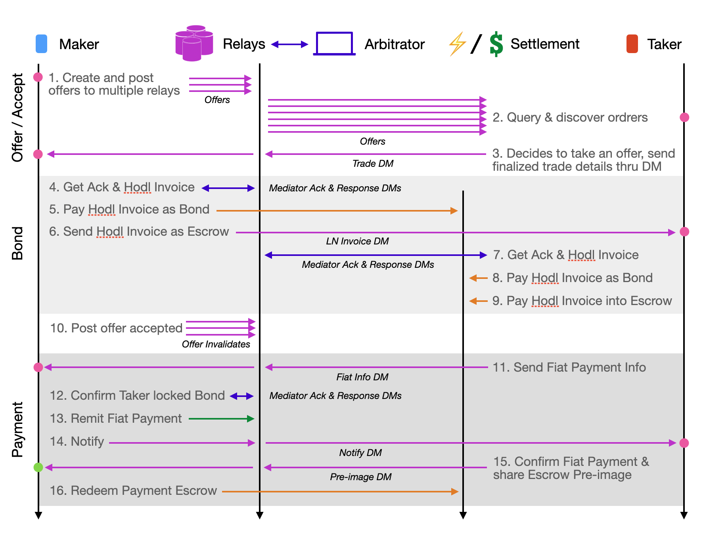

# N3XB Bitcoin Exchange Protocol
N3XB is a proposed protocol designed specifically to facilitate trade of Bitcoin against Fiat or other Fiat like settlement. The proposed values for the respective parameter are only meaningful as specified when the `offer_type` specifies Bitcoin trades.

For now, this is assuming that the first few trade mechanics to be supported are those already proven in Bisq and in Robosat. This assumption can, will and should change. A completely different trade mechanic might be the first one to be implemented, or might be implemented in addition to the tried and true. Ultimately its up to the community to standardize which values maps to which trade mechanic, up to developers to implement trade mechanics as they see fit for their particular application, and up to end-users to decide which trade mechanics they most wish to trade using.

### Maker Sells Bitcoin w/ 2 on-Chain Tx & 2 of 2 Bond

>Sequence of events a maker wants to sell on-chain Bitcoin for fiat. Trade mechanism involves 2 Bitcoin on-chain transactions, and is protected by a bond that'd be released to the mediator if mutual agreement of the trade cannot be reached until the HTLC times out. This is inspired by a trade mechanics proposed for Bisq (https://github.com/bisq-network/proposals/issues/265)

### Maker Buys Bitcoin w/ Lightning Hodl Invoice

>Sequence of events a maker want to buy Bitcoin through lightning for fiat. Trade mechanism involves 3 Lightning HODL invoices, and is protected by bonds that the arbitrator can slash as disincentive to cheat. This is inspired by trade mechanics similar to that used in Robosats (https://learn.robosats.com/docs/trade-pipeline/)

## N3X Offer Object parameters for Bitcoin Trades

| `offer_type` | description |
| ------------ | ----------- |
| 0            | Bitcoin     |


| `trade_mechanics` | description                              | 
| ----------------- | ---------------------------------------- |
| 0                 | Reserved                                 |
| 1                 | Bitcoin on-chain 4 Tx (Bisq current)     |
| 2                 | Bitcoin on-chain 2 Tx (Bisq proposed)    |
| 3                 | Bitcoin on-chain 1 Tx (Bisq theorized)   |
| 4                 | Bitcoin Lightning Hodl Invoice (Robosat) |


| `trade_mechanics_details` | see `trade_mechanics_details_object` below |
| ------------------------- | ------------------------------------------ |
|                           |                                            |


| `x_obligation_type` | description          |
| ------------------- | -------------------- |
| 0                   | Reserved             |
| 1                   | Bitcoin              |
| 2                   | Digital Fiat         |
| 3                   | Physical Fiat        |
| Default             | Other                |


| `x_obligation_details` | see `obligation_details_object` below |
| ---------------------- | ------------------------------------- |
|                        |                                       |


| `dispute_resolution_type` | description                                | 3rd party arbitration |
| ------------------------- | ------------------------------------------ | --------------------- |
| 0                         | Reserved                                   | -                     |
| 1                         | On-chain 2 of 2 MAD                        | No                    |
| 2                         | On-chain 2 of 2 w/ HTLC                    | Yes                   |
| 3                         | On-chain 2 of 3                            | Yes                   |
| 4                         | Lightning HODL Invoice Bonds & Arbitration | Yes                   |
| 65536                     | Trusted                                    | -                     |


| `dispute_resolution_details` | see `dispute_resolution_details_object` below |
| ---------------------------- | --------------------------------------------- |
|                              |                                               |


### Trade Mechanics Details Object
This can be trade mechanics and trade mechanics version specific
```
{
  "version": <integer>
}
```

### Obligation Details Object
Only applicable if `obligation_type` is 1 - 3
```
{
  "amount": <amount in integer>
  "amount_min": <minimum amount in integer. Only if maker. Can be empty>
  "rate": <rate of taker currency / maker currency in 64 bit double. Only if taker. Overrides amount. Can be empty>
  "currency": <string code of currency the amount is denominated in, USD in cents, Bitcoin in sats, etc>
  "payment_list": <list of string codes of payment methods, dependent on currency - P2WKH, P2TR, Lightning, Venmo, face to face, etc>
}
```

### Dispute Resolution Details Object
Only applicable if `dispute_resolution_type` is 1 - 4
```
{
  "maker_bond_pct": <integer of numerator of percentage out of 100 of the bond maker needs to pay as fraction of trade amount>
  "taker_bond_pct": <integer of numerator of percentage out of 100 of the bond taker needs to pay as fraction of trade amount>
  "dispute_agent_pubkey_list": <list of 32-byte lowercase hex-encoded public key of agent>
  "trade_period": <time trade needs to be completed by, if not arbitration can be requested>
  "bond_release_delay": <additional time bond can be locked by seller to minimize any fiat chargeback risk>
}
```

### N3X Encrypted Message Object Parameters for Bitcoin Trades

| `attachment_type` | description                       |
| ----------------- | --------------------------------- |
| 0                 | Notify                            |
| 1                 | Trade Contract                    |
| 2                 | Fiat Payment Info                 |
| 3                 | Mediator/Arbitration Ack Request  |
| 4                 | Mediator/Arbitration Ack Response |

### Notify Attachment Payload
For `attachment_type` of 0.
```
{
  "trade_state": <integer of state machine state, dependent on trade mechanism selected>
}
```

### Trade Contract Message Attachment Payload
For `attachment_type` of 1.
```
{
  "maker_amount": <amount in integer>
  "maker_currency": <currency 'maker_amount' is denominated in>
  "maker_payment": <payment method string code>
  "maker_bond_amount": <amount of satoshis in integer>
  "taker_amount": <amount in integer>
  "taker_currency": <currency 'taker_amount' is denominated in>
  "taker_payment": <payment method string code>
  "taker_bond_amount": <amount of satoshis in integer>
  "dispute_agent_pubkey": <32-byte lowercase hex-encoded public key of agent selected>
  "pow_preimage": <64 bytes pre-image that satisfies PoW. Prevents order taking spam>
}
```

### Fiat Payment Info Message Attachment Payload
For `attachment_type` of 2. Specific meaning of each field is dependent on the fiat payment method selected.
```
{
  "routing_id": <string>
  "bank_id": <string>
  "account_id": <string>
  "account_name": <string>
  "account_secret": <string>
  "account_note": <string>
}
```

### Mediator/Arbitration Ack Request Message Attachment Payload
For `attachment_type` of 3. Mediator/Arbitrator should look for Trade Contract Attachment from the next Payload.
```
{
  "contract_hash": <32 bytes hash of the contract involved in the mediation/arbitration>
  "request_type: <request type in integer>
}
```

| `request_type` | description   |
| -------------- | ------------- |
| 0              | Status        |
| 1              | Compatibility |
| 2              | Maker Request |
| 3              | Taker Request |

### Mediator/Arbitration Ack Response Message Attachment Payload
For `attachment_type` of 4.
```
{
  "response": <integer>
  "maker_bond_state": <integer>
  "taker_bond_state": <integer>
  "payload_type": <integer>
  "payload": <>
}
```

| `response`     | description           |
| -------------- | --------------------- |
| 0              | Unrecognized          |
| 1              | Mediating/Arbitrating |
| 2              | Payment Required      |
| 3              | Rejected              |
| 4              | Compatible            |
| 5              | Incompatible          |


| `x_bond_state`       | description                        |
| ------------------ | ---------------------------------- |
| 0                  | Not yet Queried                    |
| 1                  | Queried and bond invoice/addr sent |
| 2                  | Bond locked                        |
| 3                  | Bond expired                       |
| 4                  | Bond not required                  |


| `payload_type` | description                |
| -------------- | -------------------------- |
| 0              | N/A                        |
| 1              | Arbitrator Bitcoin Address |
| 2              | LN Hodl Invoice for Maker  |
| 3              | LN Hodl Invoice for Taker  |

## Query
- An NIP to filter outstanding offers based on all of `trade_mechanics`, `obligation_type`, `amount`, `amount_min`, `rate`, `currency` and `payments`, with the latter to allow for filtering based on a range
- An NIP to sort outstanding offers based on rate

## Trade State Machine
TBD

## NIP Dependant Enhancements
There are several optional dependencies that'd greatly enhance the user experience and efficiency of allowing to run N3X and N3XB on top of Nostr. All of these have been mentioned in context above, but this section highlights them again, as below:

### Push Notification
An NIP to make Nostr relays generate Push Notifications to clients will greatly enhance the ease of getting trades into completion. There can also be certain code execution that is entirely push triggered without requiring user intervention. This improvement proposal is equally applicable to regular Nostr encrypted direct messages and have been created as a [potential NIP](https://github.com/nostr-protocol/nips/issues/257) for the Nostr protocol.

### Offer Detail Aware Filtered Querying
An NIP to enable filtered query by a potential taker, so that only open offers of desired parameters will be fetched, will greatly enhance the user experience for a taker. Otherwise it will become infeasible very quickly as there will be way too many offers, with some perhaps already invalidated, to be remitted to a taker. It can still be usable as filtering and invalidation can be done client-side, but this will be a lot more traffic for both the client and relay.

It'd be most ideal if an NIP can be implemented such that a Nostr relay itself does not necessarily have to fully understand the kind of details it is querying on, such that future protocols outside of N3X, or protocol changes within N3X, can be supported without changing the Nostr protocol itself. This also can increase plausible deniability for node runners when it comes to hosting exchange offers.

### Sorted Query
An NIP to enable sorted query by a potential taker, so that paged response of only a limited number of open offers in sorted order will be returned to a taker. This will drastically reduce the number of offers needed to be relayed to a taker. For example, if a taker is only interested in the highest rate open offers of a particular currency pair, only a number of those needs to be remitted to the taker. Otherwise the taker will need to fetch all potential offers and sort through them client-side, increasing traffic load for both relay and client.